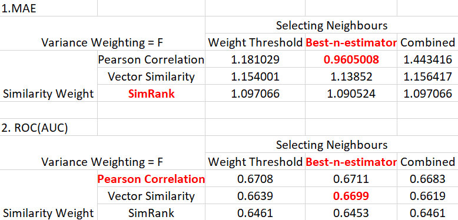

# Project 4: Collaborative Filtering

### [Project Description](doc/project4_desc.md)

Term: Spring 2018

+ Team 7
+ Projec title: Collaborative Filtering
+ Team members
	+ Ding, Xueying xd2196@columbia.edu
	+ Fan, Xiaochen xf2170@columbia.edu
	+ Guo, Tao tg2620@columbia.edu
	+ Jiang, Chenfei cj2526@columbia.edu
	+ Yu, Linna ly2424@columbia.edu
+ Project summary: In this project, we applied memory-based algorithm and model-based algorithm to do collaborative filtering. For memory-based algorithm, first we use pearson correlation, vector similarity and simrank(only for Movie data) to gain similarity weight, then we use weight threshold, best-n-estimator and combined to select neighborhoods, finally we predict based above elements. For model-based algorithm, we use cluster models with EM algorithm. We choose the number of classes by selecting the model structure thet yields the largest marginal likelihood of the data. After obtain the best C, we evaluate it with rank score and compare the results with memory-based model.
We use Rank Score to evaluate MS data, MAE and ROC to evaluate Movie data. Here are our results. Red parts mean the best.
+ MS


+ Movie



	
**Contribution statement**: 
+ Model-based Algorithm: 
  [Implementation of cluster model, optimization of cluster model parameters.]
     + Guo, Tao: Completing the Model-based Alogorithm with Linna Yu. We improve the algorithrm, train the data, come up with the best number of clusters. Calculating the rank score and compared with memory-based algorithm.
     
     + Yu, Linna: Completing the Model-based Alogorithm with Tao Guo. We improve the algorithrm, train the data, come up with the best number of clusters. Calculating the rank score and compared with memory-based algorithm. 

+ Memory-based Algorithm:
     + Ding, Xueying:
     + Fan, Xiaochen:
     + Jiang, Chenfei:

Following [suggestions](http://nicercode.github.io/blog/2013-04-05-projects/) by [RICH FITZJOHN](http://nicercode.github.io/about/#Team) (@richfitz). This folder is orgarnized as follows.

```
proj/
├── lib/
├── data/
├── doc/
├── figs/
└── output/
```

Please see each subfolder for a README file.
